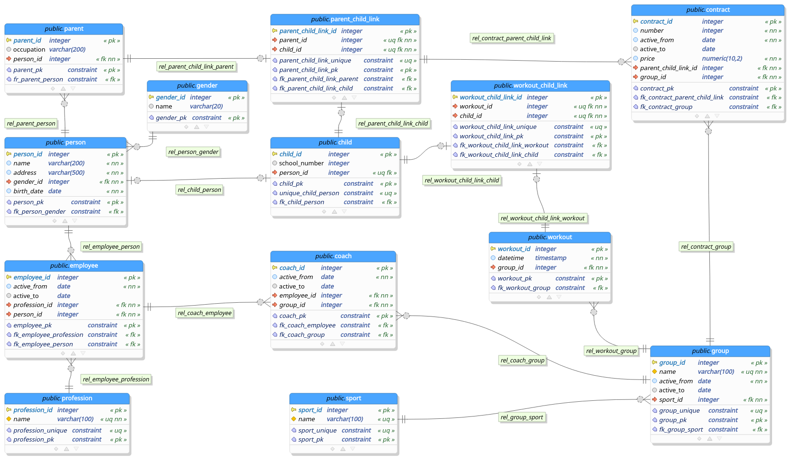

# Advanced Data Management
## HW3 – Building PDM and Database
### Physical Data Modeling
The [physical data model](db_model) for the Postgresql DBMS  has developed using the pgmodeler tool ([open-source, multiplatform database modeler for PostgreSQL](https://github.com/pgmodeler/pgmodeler))

### Database creation
[The database initialization script](db/init.sql) is automatically generated based on the pgmodeler model.
[The python script](main.py) initializes the database and fills the database with generated data.
The solution is deployed using [docker-compose](docker-compose.yml) with three containers:
- a container with a Postgresql DBMS,
- a container with a python script filling the database,
- a container with a pgAdmin database administration tool.
